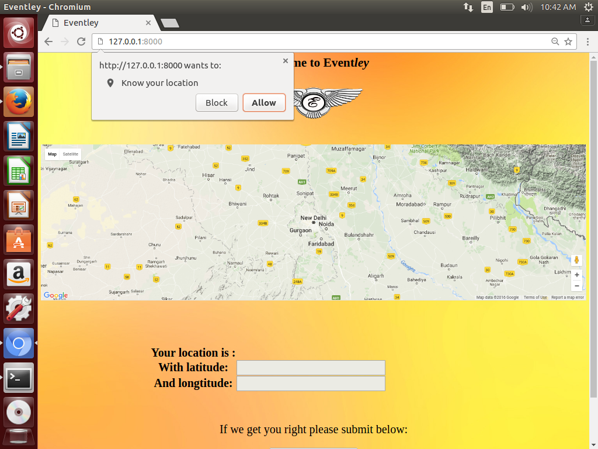
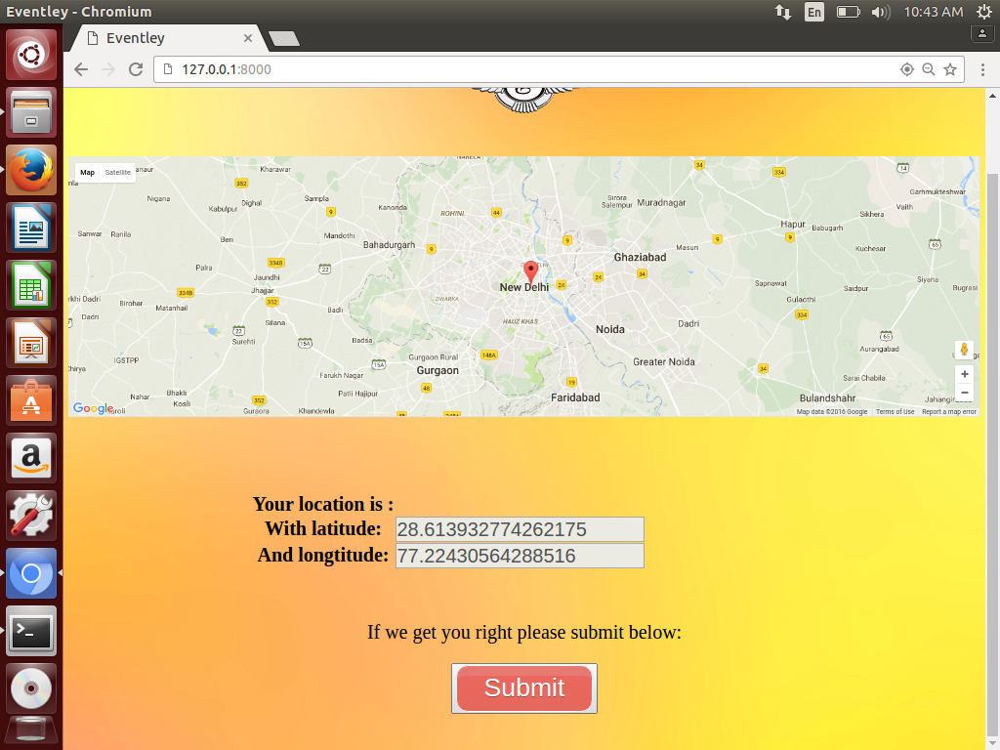
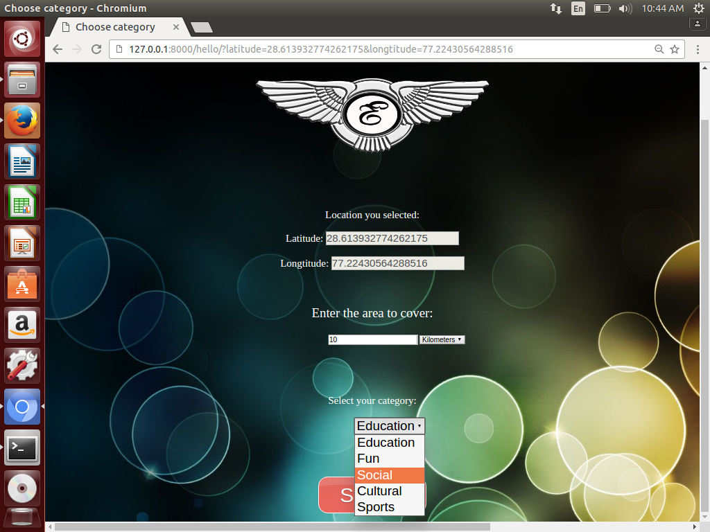
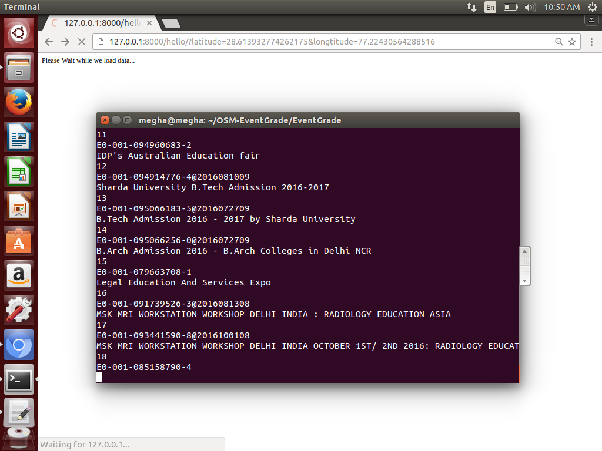
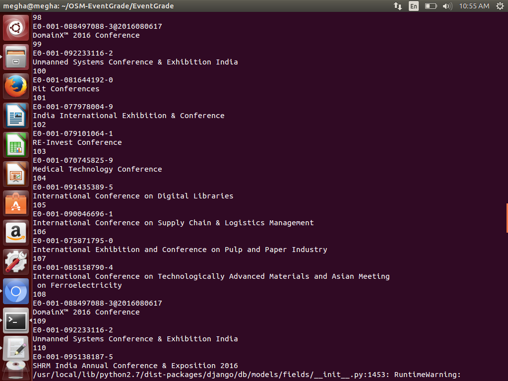
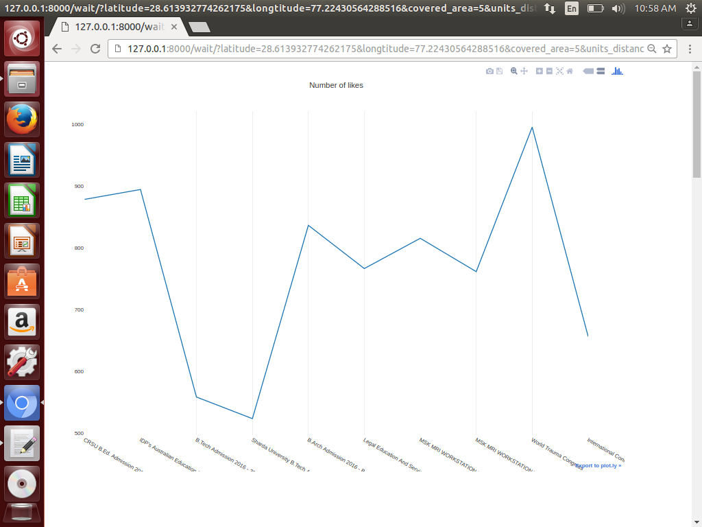
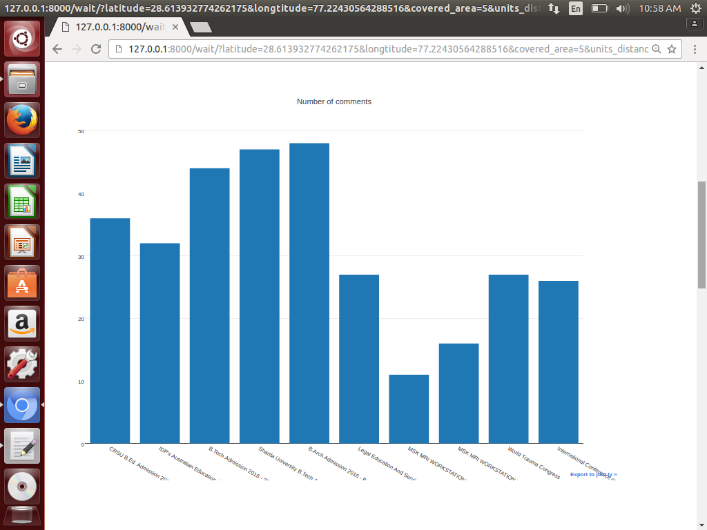
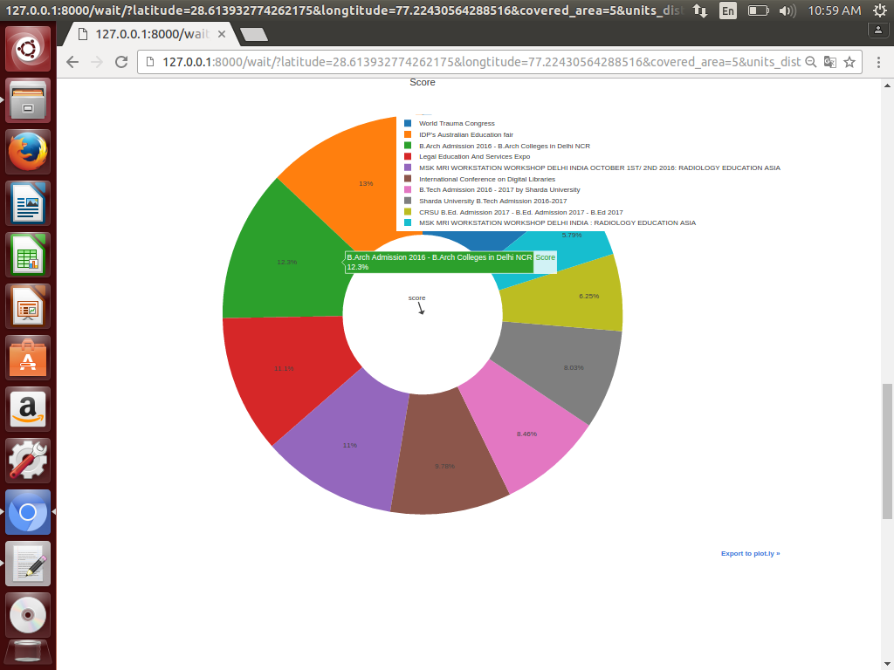
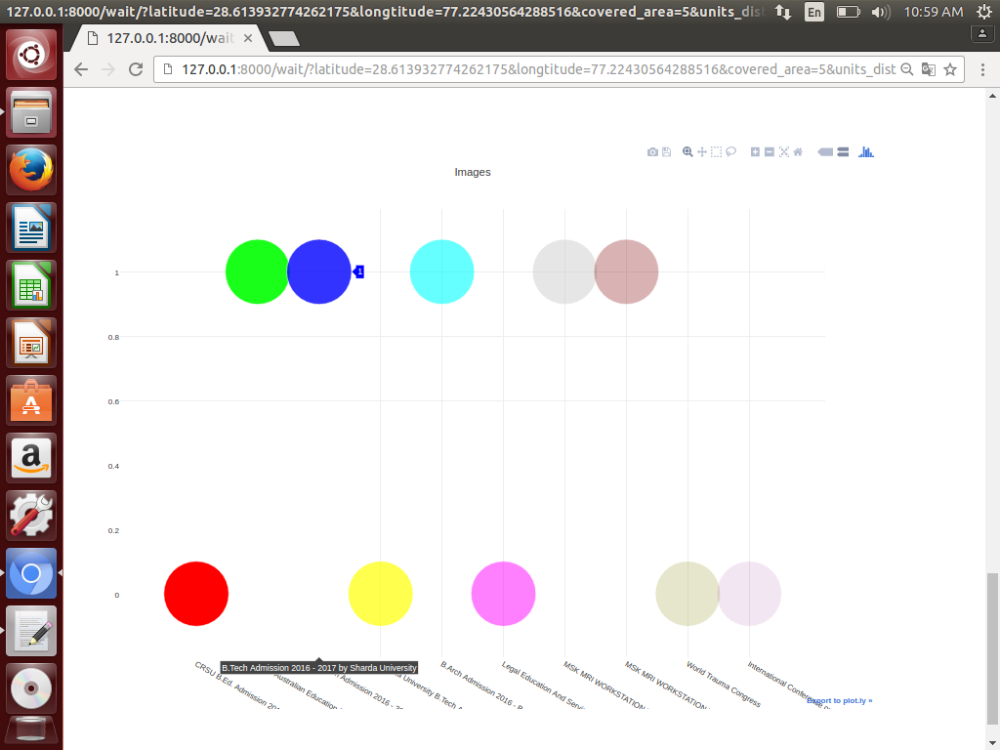
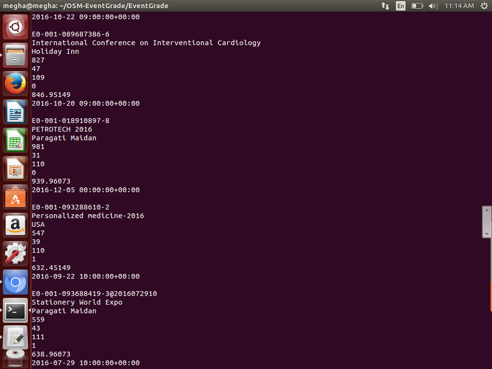

# OSM-EventGrade

Problem Statement: Difficulty in finding the most suitable place to visit for an event or outing

Idea: The solution provides a way to assist you in choosing among various options based on popularity

Description: To analyse popularity of events near user specified location based on number of likes, number of comments, number of images , weather at time of event, etc. Also, user can select category of events on basis of his choice like education, social, etc. Eventley help users to find popular and relevant(weather on day is fine) events near him on basis of his choice of category.

(Currently, website is not loading data from API due to depreciation of API, screenshots can be referred at https://codeb1ooded.github.io/eventley.html) 
 

Technology stack: A website with backend supported in Django using a kind of data science
Languages used: Python, Django, Html, Css, JS

### <a href="https://eventley.herokuapp.com/"> View Demo </a>

## Screenshots:

  
  &nbsp;&nbsp;&nbsp;&nbsp;&nbsp;&nbsp;&nbsp;&nbsp;
  

  
  &nbsp;&nbsp;&nbsp;&nbsp;&nbsp;&nbsp;&nbsp;&nbsp;
  

  
  &nbsp;&nbsp;&nbsp;&nbsp;&nbsp;&nbsp;&nbsp;&nbsp;
  

  
  &nbsp;&nbsp;&nbsp;&nbsp;&nbsp;&nbsp;&nbsp;&nbsp;
  

  
  &nbsp;&nbsp;&nbsp;&nbsp;&nbsp;&nbsp;&nbsp;&nbsp;
  

  

## Setup (Commands are for linux)
* Install python  
* Install pip ( sudo apt-get install python-pip python-dev build-essential)  
* Install djnago (sudo pip install Django==1.9.7)  
* Install MySQLDB (sudo apt-get install python-mysqldb)  
* Install python unicodecsv module (sudo pip install unicodecsv)  
* Install python library of JSON (sudo pip install simplejson)  
* Install plotly python library (sudo pip install plotly)  
* Clone the repository: git clone https://github.com/codeb1ooded/OSM-EventGrade.git  
* Move to your clone repo folder: ~/OSM-EventGrade/Eventgrade/  
* Open in terminal and type "python manage.py runserver"  
* Hey you are good to go and your server is rnning. Now you can visit : 127.0.0.1:8000/
 
#### Admin Access:
* Go to the link: 127.0.0.1:8000/admin/
* Enter username as 'osn' and password as 'online 2016'
* Now you can see the database and have admin access to your localmachine site

#### Data Collection & Analysis
* Python
* Eventful API (deprecated)
* Google Maps API 
* Open Weather API 

#### Front End and Visualisations
* HTML,CSS, JavaScript 
* Plotly.js 
* Google Maps API 

#### FrameWork used
* Django  (DB - Sqlite3) 

### DATA ANALYSIS
Score = (0.25 * distanceScore + 0.75 * #likes + #comments + 2 * #images + 1.5 * #links) * (weatherScore / 2)  
WeatherScore:  if ((maxtmp > 35) or (mintmp < 25) ) then return "1"   else return “2”  
distanceScore : (distance_in_km – distance_loc)* 100 / distance_in_km  
